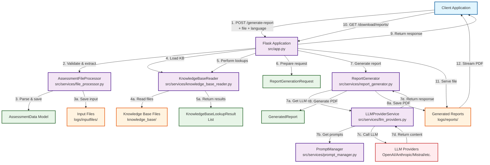

# Generate Report Flow Context Diagram

Adding a change in the raw text view. Adding **more** text in MARKDOWN pane.

## Overview

This document describes the comprehensive flow from when a client visits the `/generate-report` route to where they retrieve the generated PDF at `/download/reports/<filename>`. The flow involves multiple services, file processing, knowledge base lookups, LLM integration, and PDF generation.

## Header 2 inserted (here)

This is nice and **bold** is working like _italic._ But strikethrough is not working. Now trying ~strikethrough~ from the raw text view.

Let’s add a line below.

* * *

That worked well. Now we try an ordered list:

1.  Item 1
    
2.  Item 2
    
3.  Item 3
    

Works, but the rows have too large gaps.

And a **checkboxed** list:

Is **not** working.

How about we insert a **3x4 table** below:

Is **not** working

## Flow Description

### 1\. Initial Request Processing

*   **Route**: `POST /generate-report`
    
*   **Authentication**: API key required via `@require_api_key` decorator
    
*   **Request Validation**:
    
    *   File upload validation (`request.files['file']`)
        
    *   Language parameter extraction (defaults to 'CH\_de')
        
    *   Optional provider/model overrides
        

And this ~strikethrough text~

*   \[ \] Task item
    

<table style="min-width: 75px;"><colgroup><col style="min-width: 25px;"><col style="min-width: 25px;"><col style="min-width: 25px;"></colgroup><tbody><tr><th colspan="1" rowspan="1">
Header
</th><th colspan="1" rowspan="1">
Header
</th><th colspan="1" rowspan="1">
Header
</th></tr><tr><td colspan="1" rowspan="1">

</td><td colspan="1" rowspan="1">

</td><td colspan="1" rowspan="1">

</td></tr><tr><td colspan="1" rowspan="1">

</td><td colspan="1" rowspan="1">

</td><td colspan="1" rowspan="1">

</td></tr><tr><td colspan="1" rowspan="1">

</td><td colspan="1" rowspan="1">

</td><td colspan="1" rowspan="1">

</td></tr><tr><td colspan="1" rowspan="1">

</td><td colspan="1" rowspan="1">

</td><td colspan="1" rowspan="1">

</td></tr></tbody></table>

### 2\. File Processing Phase

*   **Service**: `AssessmentFileProcessor`
    
*   **Actions**:
    
    *   Process uploaded assessment file
        
    *   Parse assessment data into structured format
        
    *   Save input file to logs directory
        
    *   Generate unique basename for all related files
        
*   **Output**: `AssessmentData` object with parsed entries and metadata
    

### 3\. Knowledge Base Loading

*   **Service**: `KnowledgeBaseReader`
    
*   **Actions**:
    
    *   Load Swiss German knowledge base for specified language
        
    *   Cache knowledge base content in memory
        
    *   Handle missing knowledge base gracefully
        
*   **Output**: Loaded knowledge base ready for lookups
    

### 4\. Knowledge Base Lookups

*   **Service**: `KnowledgeBaseReader`
    
*   **Actions**:
    
    *   Iterate through all answered assessment entries
        
    *   Perform lookups for questions and consequences/recommendations
        
    *   Match by question keys (4-digit format: #+.#+.#+.#+)
        
    *   Match by full keys (5-digit format: #+.#+.#+.#+.#)
        
*   **Output**: List of `KnowledgeBaseLookupResult` objects
    

### 5\. Report Generation Request Preparation

*   **Service**: `ReportGenerationRequest` model
    
*   **Actions**:
    
    *   Create structured generation request
        
    *   Set output format to "pdf"
        
    *   Configure language and provider preferences
        
    *   Include file basename for consistent naming
        
*   **Output**: Structured request object for report generation
    

### 6\. LLM Content Generation

*   **Service**: `ReportGenerator` → `LLMProviderService`
    
*   **Actions**:
    
    *   Select appropriate LLM provider (OpenAI, Anthropic, Mistral, etc.)
        
    *   Generate system prompts using `PromptManager`
        
    *   Send assessment data and knowledge lookups to LLM
        
    *   Receive structured report content
        
*   **Output**: LLM-generated report content with metadata
    

### 7\. PDF Generation

*   **Service**: `ReportGenerator`
    
*   **Actions**:
    
    *   Parse LLM response into structured sections
        
    *   Generate PDF using WeasyPrint (markdown path) or ReportLab (fallback)
        
    *   Apply consistent styling and formatting
        
    *   Include metadata header with report information
        
*   **Output**: PDF file saved to `logs/reports/` directory
    

### 8\. Response Generation

*   **Service**: Flask route handler
    
*   **Actions**:
    
    *   Prepare success response with report metadata
        
    *   Include download path: `/download/reports/<filename>`
        
    *   Log generation statistics and timing
        
    *   Return JSON response to client
        
*   **Output**: HTTP 200 response with report details
    

### 9\. File Download

*   **Route**: `GET /download/reports/<filename>`
    
*   **Authentication**: API key required
    
*   **Actions**:
    
    *   Validate requested filename
        
    *   Serve file from `logs/reports/` directory
        
    *   Set appropriate headers for file download
        
*   **Output**: PDF file streamed to client
    

## Context Diagram

## Key Components and Their Roles

### Core Services

1.  **AssessmentFileProcessor**
    
    *   Handles file upload validation and parsing
        
    *   Converts various input formats to structured data
        
    *   Manages file storage and naming conventions
        
2.  **KnowledgeBaseReader**
    
    *   Loads and caches Swiss German knowledge base
        
    *   Performs efficient lookups for questions and recommendations
        
    *   Handles multiple language variants
        
3.  **ReportGenerator**
    
    *   Orchestrates the entire report generation process
        
    *   Integrates LLM content with PDF generation
        
    *   Manages report metadata and file output
        
4.  **LLMProviderService**
    
    *   Manages multiple LLM provider integrations
        
    *   Handles provider selection and fallback
        
    *   Tracks usage metrics and costs
        
5.  **PromptManager**
    
    *   Manages system prompts and templates
        
    *   Handles dynamic prompt generation
        
    *   Supports multiple languages and formats
        

### Data Flow

1.  **Input Processing**: Raw file → Structured assessment data
    
2.  **Knowledge Integration**: Assessment data + KB lookups → Enriched content
    
3.  **LLM Generation**: Enriched content → AI-generated report sections
    
4.  **PDF Creation**: Report sections → Formatted PDF document
    
5.  **File Delivery**: PDF file → Client download
    

### Error Handling

*   **File Validation**: Invalid files return 400 with specific error types
    
*   **LLM Failures**: Timeouts (504), invalid requests (422), general errors (500)
    
*   **Missing Resources**: Graceful degradation when knowledge base unavailable
    
*   **Provider Failures**: Automatic fallback to alternative LLM providers
    

### Performance Considerations

*   **Async Processing**: Report generation runs asynchronously
    
*   **Caching**: Knowledge base cached in memory for repeated lookups
    
*   **File Management**: Consistent naming prevents conflicts
    
*   **Resource Cleanup**: Temporary files managed automatically
    

## Security and Authentication

*   **API Key Required**: All endpoints protected by `@require_api_key`
    
*   **File Validation**: Strict file type and content validation
    
*   **Path Security**: Secure filename handling prevents directory traversal
    
*   **Access Control**: Reports only accessible via authenticated download endpoint
    

## Monitoring and Logging

*   **Request Tracking**: Unique request IDs for end-to-end tracing
    
*   **Performance Metrics**: Timing for each processing phase
    
*   **Error Logging**: Comprehensive error capture and reporting
    
*   **Usage Analytics**: LLM provider usage, token counts, and costs
    

This flow represents a robust, production-ready system that handles the complete lifecycle of assessment report generation, from file upload through PDF delivery, with comprehensive error handling, monitoring, and security measures.

*   New edit