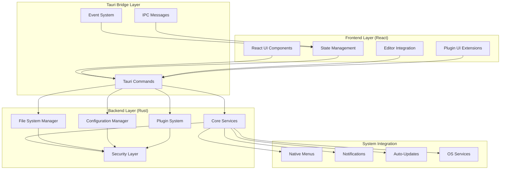
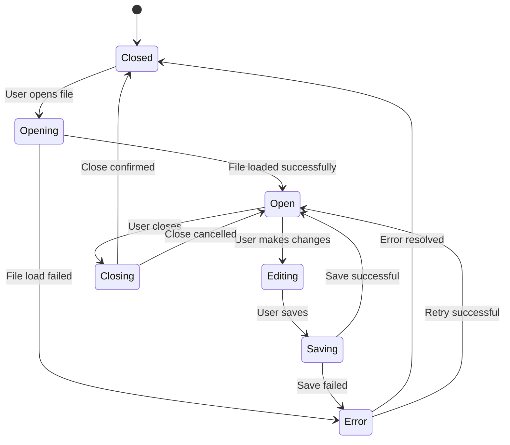

# MarkWriter v2.0 System Architecture

**Version**: 1.0  
**Date**: August 26, 2025  
**Target**: Rust + Tauri + React Rewrite  

## Executive Summary

MarkWriter v2.0 represents a complete architectural modernization from Python/PySide6/Qt to Rust/Tauri/React. This design prioritizes **security**, **performance**, and **extensibility** while maintaining feature parity and improving user experience through modern web-based UI patterns.

### Core Architectural Principles
1. **Security-First**: Memory-safe Rust backend with capability-based permissions
2. **Performance**: Native system integration with optimized resource usage
3. **Extensibility**: Plugin-ready architecture with clear API boundaries
4. **Cross-Platform**: Unified codebase with platform-specific optimizations
5. **Modern UX**: React-based interface with contemporary design patterns

## System Architecture Overview



## Frontend Architecture (React)

### Component Hierarchy

```
MarkWriterApp/
├── Layout/
│   ├── AppShell           # Main application container
│   ├── MenuBar           # Cross-platform menu integration
│   ├── ToolBar           # Action buttons and controls
│   ├── StatusBar         # File status and metadata
│   └── SidePanel         # File explorer, outline view
├── Editor/
│   ├── EditorContainer   # Toast UI Editor wrapper
│   ├── EditorToolbar     # Editor-specific controls
│   ├── PreviewPane       # Markdown preview
│   └── EditorExtensions  # Plugin-provided editor enhancements
├── Dialogs/
│   ├── FileDialogs       # Open/Save dialogs (native integration)
│   ├── SettingsDialog    # Application preferences
│   ├── AboutDialog       # Version and attribution info
│   └── PluginManager     # Plugin management interface
├── Plugins/
│   ├── PluginContainer   # Plugin UI mounting point
│   ├── DiagramRenderer   # Mermaid/Draw.io integration
│   └── FormatSupport     # JSON/XML/other format handlers
└── Common/
    ├── Button            # Consistent button components
    ├── Input             # Form input components
    ├── Modal             # Modal dialog system
    └── Theme             # Theme and styling system
```

### State Management Strategy

**Selected Solution**: **Zustand** with TypeScript
- Lightweight, minimal boilerplate
- Excellent TypeScript integration
- Good performance for document editing use cases
- Easy testing and debugging

```typescript
// Core application state structure
interface AppState {
  // Document management
  documents: {
    active: DocumentId | null;
    open: Map<DocumentId, Document>;
    recent: DocumentMetadata[];
  };
  
  // Editor state
  editor: {
    mode: 'wysiwyg' | 'markdown' | 'preview';
    zoom: number;
    wordWrap: boolean;
    showOutline: boolean;
  };
  
  // UI state
  ui: {
    theme: 'light' | 'dark' | 'system';
    sidebarOpen: boolean;
    activeDialog: string | null;
    menuState: MenuState;
  };
  
  // Settings
  settings: UserSettings;
  
  // Plugin state
  plugins: {
    loaded: Plugin[];
    enabled: Set<PluginId>;
    state: Map<PluginId, any>;
  };
}
```

### UI/UX Design System

**Design Language**: Modern, minimal, productivity-focused
- **Color Palette**: System-adaptive with high contrast ratios
- **Typography**: System fonts with excellent readability
- **Spacing**: 8px grid system for consistent layouts
- **Components**: Accessible, keyboard-navigable, touch-friendly

**Design Tokens**:
```css
:root {
  /* Colors - Light Mode */
  --color-bg-primary: #ffffff;
  --color-bg-secondary: #f8f9fa;
  --color-text-primary: #1a1a1a;
  --color-text-secondary: #6b7280;
  --color-accent: #3b82f6;
  --color-success: #10b981;
  --color-warning: #f59e0b;
  --color-error: #ef4444;
  
  /* Spacing */
  --space-xs: 4px;
  --space-sm: 8px;
  --space-md: 16px;
  --space-lg: 24px;
  --space-xl: 32px;
  
  /* Typography */
  --font-family-sans: -apple-system, BlinkMacSystemFont, 'Segoe UI', system-ui;
  --font-family-mono: 'SF Mono', Monaco, 'Cascadia Code', monospace;
}

@media (prefers-color-scheme: dark) {
  :root {
    --color-bg-primary: #1a1a1a;
    --color-bg-secondary: #2d2d2d;
    --color-text-primary: #ffffff;
    --color-text-secondary: #a1a1aa;
  }
}
```

### Editor Integration Strategy

**Toast UI Editor Integration**:
```typescript
interface EditorBridge {
  // Core editor functionality
  setMarkdown(content: string): Promise<void>;
  getMarkdown(): Promise<string>;
  getHTML(): Promise<string>;
  
  // Editor state management
  setMode(mode: EditorMode): Promise<void>;
  focus(): Promise<void>;
  
  // Content manipulation
  insertText(text: string, position?: number): Promise<void>;
  replaceSelection(text: string): Promise<void>;
  
  // Event handling
  onContentChange(callback: (content: string) => void): void;
  onSelectionChange(callback: (selection: Selection) => void): void;
  
  // Plugin extensions
  registerExtension(extension: EditorExtension): Promise<void>;
  removeExtension(extensionId: string): Promise<void>;
}
```

## Backend Architecture (Rust)

### Core Services and Modules

```rust
// Main application structure
pub struct MarkWriterApp {
    file_manager: Arc<FileManager>,
    config_manager: Arc<ConfigManager>,
    plugin_system: Arc<PluginSystem>,
    security_layer: Arc<SecurityLayer>,
    event_bus: Arc<EventBus>,
}

// Core service modules
mod file_manager;     // File operations, recent files, backup
mod config_manager;   // Settings, preferences, user data
mod plugin_system;    // Plugin loading, API, sandboxing
mod security_layer;   // Permissions, validation, sanitization
mod event_bus;        // Internal event system
mod menu_service;     // Native menu integration
mod update_service;   // Auto-update functionality
```

### File System Operations and Safety

```rust
pub struct FileManager {
    // Secure file operations with capability-based permissions
    allowed_paths: HashSet<PathBuf>,
    temp_dir: PathBuf,
    backup_manager: BackupManager,
}

impl FileManager {
    // Core file operations
    pub async fn read_file(&self, path: &Path) -> Result<String, FileError>;
    pub async fn write_file(&self, path: &Path, content: &str) -> Result<(), FileError>;
    pub async fn export_html(&self, path: &Path, content: &str) -> Result<(), FileError>;
    
    // Document management
    pub async fn create_document(&self) -> Result<DocumentId, FileError>;
    pub async fn open_document(&self, path: &Path) -> Result<Document, FileError>;
    pub async fn save_document(&self, doc: &Document) -> Result<(), FileError>;
    
    // Security and validation
    fn validate_path(&self, path: &Path) -> Result<(), SecurityError>;
    fn sanitize_content(&self, content: &str) -> String;
    
    // Backup and recovery
    pub async fn create_backup(&self, doc: &Document) -> Result<(), BackupError>;
    pub async fn restore_from_backup(&self, path: &Path) -> Result<Document, BackupError>;
}
```

### Configuration and Settings Management

```rust
#[derive(Debug, Serialize, Deserialize)]
pub struct UserSettings {
    // Editor preferences
    pub editor: EditorSettings,
    
    // UI preferences
    pub ui: UiSettings,
    
    // File handling
    pub files: FileSettings,
    
    // Plugin configuration
    pub plugins: PluginSettings,
}

#[derive(Debug, Serialize, Deserialize)]
pub struct EditorSettings {
    pub default_mode: EditorMode,
    pub font_family: String,
    pub font_size: u32,
    pub line_height: f32,
    pub tab_size: u32,
    pub word_wrap: bool,
    pub auto_save_interval: Duration,
}

pub struct ConfigManager {
    config_path: PathBuf,
    settings: RwLock<UserSettings>,
    watchers: Vec<Box<dyn SettingsWatcher>>,
}

impl ConfigManager {
    pub async fn load_settings(&self) -> Result<UserSettings, ConfigError>;
    pub async fn save_settings(&self, settings: &UserSettings) -> Result<(), ConfigError>;
    pub async fn update_setting<T>(&self, key: &str, value: T) -> Result<(), ConfigError>;
    pub fn watch_changes(&self, watcher: Box<dyn SettingsWatcher>);
}
```

### Plugin API Design

```rust
// Plugin trait definition
pub trait MarkWriterPlugin: Send + Sync {
    fn metadata(&self) -> PluginMetadata;
    fn initialize(&mut self, api: &PluginApi) -> Result<(), PluginError>;
    fn shutdown(&mut self) -> Result<(), PluginError>;
    
    // Optional extension points
    fn on_document_opened(&self, _doc: &Document) -> Result<(), PluginError> { Ok(()) }
    fn on_document_saved(&self, _doc: &Document) -> Result<(), PluginError> { Ok(()) }
    fn on_content_changed(&self, _content: &str) -> Result<Option<String>, PluginError> { Ok(None) }
}

// Plugin API for safe interactions
pub struct PluginApi {
    file_access: LimitedFileAccess,
    ui_extensions: UiExtensionApi,
    event_emitter: EventEmitter,
    settings_access: SettingsAccess,
}

// Plugin system manager
pub struct PluginSystem {
    plugins: HashMap<PluginId, Box<dyn MarkWriterPlugin>>,
    registry: PluginRegistry,
    sandbox: PluginSandbox,
}
```

## Inter-Process Communication Strategy

### Tauri Command Interface

```rust
// File operations
#[tauri::command]
pub async fn open_file(path: String, app: AppHandle) -> Result<Document, String> {
    let file_manager = app.state::<FileManager>();
    file_manager.open_document(Path::new(&path))
        .await
        .map_err(|e| e.to_string())
}

#[tauri::command]
pub async fn save_file(doc: Document, app: AppHandle) -> Result<(), String> {
    let file_manager = app.state::<FileManager>();
    file_manager.save_document(&doc)
        .await
        .map_err(|e| e.to_string())
}

// Settings management
#[tauri::command]
pub async fn get_settings(app: AppHandle) -> Result<UserSettings, String> {
    let config_manager = app.state::<ConfigManager>();
    config_manager.load_settings()
        .await
        .map_err(|e| e.to_string())
}

#[tauri::command]
pub async fn update_setting(key: String, value: serde_json::Value, app: AppHandle) -> Result<(), String> {
    let config_manager = app.state::<ConfigManager>();
    config_manager.update_setting(&key, value)
        .await
        .map_err(|e| e.to_string())
}

// Plugin management
#[tauri::command]
pub async fn load_plugin(plugin_path: String, app: AppHandle) -> Result<PluginMetadata, String> {
    let plugin_system = app.state::<PluginSystem>();
    plugin_system.load_plugin(Path::new(&plugin_path))
        .await
        .map_err(|e| e.to_string())
}
```

### Event System

```typescript
// Frontend event handling
import { listen } from '@tauri-apps/api/event';

// Document events
await listen<Document>('document-changed', (event) => {
  updateDocumentState(event.payload);
});

// Settings events
await listen<UserSettings>('settings-updated', (event) => {
  applySettingsChange(event.payload);
});

// Plugin events
await listen<PluginEvent>('plugin-event', (event) => {
  handlePluginEvent(event.payload);
});
```

```rust
// Backend event emission
use tauri::Manager;

impl EventBus {
    pub fn emit_document_changed(&self, window: &Window, doc: &Document) {
        window.emit("document-changed", doc)
            .expect("Failed to emit document-changed event");
    }
    
    pub fn emit_settings_updated(&self, window: &Window, settings: &UserSettings) {
        window.emit("settings-updated", settings)
            .expect("Failed to emit settings-updated event");
    }
}
```

## Security Model and Sandboxing

### Capability-Based Permissions

```rust
pub struct SecurityLayer {
    file_permissions: FilePermissions,
    network_permissions: NetworkPermissions,
    system_permissions: SystemPermissions,
}

pub struct FilePermissions {
    allowed_read_paths: HashSet<PathBuf>,
    allowed_write_paths: HashSet<PathBuf>,
    temp_directory: PathBuf,
}

impl SecurityLayer {
    pub fn check_file_access(&self, path: &Path, access: FileAccess) -> Result<(), SecurityError> {
        match access {
            FileAccess::Read => {
                if self.file_permissions.allowed_read_paths.iter()
                    .any(|p| path.starts_with(p)) {
                    Ok(())
                } else {
                    Err(SecurityError::FileAccessDenied)
                }
            },
            FileAccess::Write => {
                if self.file_permissions.allowed_write_paths.iter()
                    .any(|p| path.starts_with(p)) {
                    Ok(())
                } else {
                    Err(SecurityError::FileAccessDenied)
                }
            }
        }
    }
    
    pub fn sanitize_html(&self, html: &str) -> String {
        // Use ammonia or similar for HTML sanitization
        ammonia::clean(html)
    }
    
    pub fn validate_plugin_manifest(&self, manifest: &PluginManifest) -> Result<(), SecurityError> {
        // Validate plugin permissions and capabilities
        // Check for suspicious patterns or excessive permissions
        Ok(())
    }
}
```

### Content Security Policy

```rust
// Tauri configuration
tauri::Builder::default()
    .setup(|app| {
        let window = app.get_window("main").unwrap();
        
        // Set strict CSP
        window.eval("
            document.querySelector('meta[http-equiv=\"Content-Security-Policy\"]')
                .setAttribute('content', \"default-src 'self' tauri:; script-src 'self' 'unsafe-inline' tauri:; style-src 'self' 'unsafe-inline' tauri:; img-src 'self' data: tauri:;\");
        ")?;
        
        Ok(())
    })
```

## Data Flow and State Management

### Document Lifecycle



### State Synchronization

```typescript
// Frontend state management with Zustand
import { create } from 'zustand';
import { invoke } from '@tauri-apps/api/tauri';

interface DocumentStore {
  documents: Map<string, Document>;
  activeDocument: string | null;
  
  // Actions
  openDocument: (path: string) => Promise<void>;
  saveDocument: (id: string) => Promise<void>;
  closeDocument: (id: string) => Promise<void>;
  updateContent: (id: string, content: string) => void;
}

const useDocumentStore = create<DocumentStore>((set, get) => ({
  documents: new Map(),
  activeDocument: null,
  
  openDocument: async (path: string) => {
    try {
      const document = await invoke<Document>('open_file', { path });
      set(state => ({
        documents: new Map(state.documents).set(document.id, document),
        activeDocument: document.id
      }));
    } catch (error) {
      // Handle error
      console.error('Failed to open document:', error);
    }
  },
  
  saveDocument: async (id: string) => {
    const document = get().documents.get(id);
    if (document) {
      try {
        await invoke('save_file', { doc: document });
        // Update document state to mark as saved
        set(state => ({
          documents: new Map(state.documents).set(id, { ...document, isDirty: false })
        }));
      } catch (error) {
        console.error('Failed to save document:', error);
      }
    }
  },
  
  // ... other actions
}));
```

## Cross-Platform Considerations

### Platform-Specific Adaptations

```rust
// Platform-specific menu handling
#[cfg(target_os = "macos")]
mod macos_integration {
    use tauri::{Menu, MenuItem, Submenu, CustomMenuItem};
    
    pub fn create_menu() -> Menu {
        let app_submenu = Submenu::new("MarkWriter", Menu::new()
            .add_item(CustomMenuItem::new("about", "About MarkWriter"))
            .add_native_item(MenuItem::Separator)
            .add_item(CustomMenuItem::new("preferences", "Preferences...").accelerator("Cmd+,"))
            .add_native_item(MenuItem::Separator)
            .add_item(CustomMenuItem::new("hide", "Hide MarkWriter").accelerator("Cmd+H"))
            .add_item(CustomMenuItem::new("quit", "Quit MarkWriter").accelerator("Cmd+Q"))
        );
        
        let file_submenu = Submenu::new("File", Menu::new()
            .add_item(CustomMenuItem::new("new", "New").accelerator("Cmd+N"))
            .add_item(CustomMenuItem::new("open", "Open...").accelerator("Cmd+O"))
            .add_native_item(MenuItem::Separator)
            .add_item(CustomMenuItem::new("save", "Save").accelerator("Cmd+S"))
            .add_item(CustomMenuItem::new("save_as", "Save As...").accelerator("Cmd+Shift+S"))
        );
        
        Menu::new()
            .add_submenu(app_submenu)
            .add_submenu(file_submenu)
    }
}

#[cfg(not(target_os = "macos"))]
mod other_integration {
    // Windows/Linux menu structure
    pub fn create_menu() -> Menu {
        // Traditional File/Edit/View/Help menu structure
    }
}
```

### Native Integration Points

```rust
// File associations and document types
#[cfg(target_os = "macos")]
pub fn register_file_types() -> Result<(), PlatformError> {
    // Register .md, .markdown file associations
    // Update Info.plist with document types
    Ok(())
}

#[cfg(target_os = "windows")]
pub fn register_file_types() -> Result<(), PlatformError> {
    // Register Windows file associations in registry
    Ok(())
}

// System tray integration
pub fn setup_system_tray(app: &AppHandle) -> Result<(), TrayError> {
    let tray_menu = SystemTrayMenu::new()
        .add_item(CustomMenuItem::new("show", "Show MarkWriter"))
        .add_native_item(SystemTrayMenuItem::Separator)
        .add_item(CustomMenuItem::new("quit", "Quit"));
    
    SystemTray::new()
        .with_menu(tray_menu)
        .build(app)?;
    
    Ok(())
}
```

### Build and Packaging Strategy

```toml
# Cargo.toml - Build configuration
[package]
name = "markwriter"
version = "2.0.0"
edition = "2021"

[dependencies]
tauri = { version = "1.5", features = ["api-all"] }
serde = { version = "1.0", features = ["derive"] }
tokio = { version = "1.0", features = ["full"] }
ammonia = "3.3"  # HTML sanitization
dirs = "5.0"     # Cross-platform directories
notify = "6.1"   # File watching

[build-dependencies]
tauri-build = { version = "1.5", features = [] }

# Platform-specific features
[target.'cfg(target_os = "macos")'.dependencies]
cocoa = "0.24"

[target.'cfg(target_os = "windows")'.dependencies]
winapi = "0.3"

[target.'cfg(target_os = "linux")'.dependencies]
gtk = "0.16"
```

```json
// tauri.conf.json - Tauri configuration
{
  "package": {
    "productName": "MarkWriter",
    "version": "2.0.0"
  },
  "build": {
    "distDir": "../frontend/dist",
    "devPath": "http://localhost:3000"
  },
  "tauri": {
    "allowlist": {
      "all": false,
      "fs": {
        "all": false,
        "readFile": true,
        "writeFile": true,
        "readDir": true,
        "exists": true,
        "scope": ["$DOCUMENT/*", "$DESKTOP/*", "$DOWNLOAD/*"]
      },
      "dialog": {
        "all": false,
        "open": true,
        "save": true
      },
      "window": {
        "all": false,
        "close": true,
        "hide": true,
        "show": true,
        "maximize": true,
        "minimize": true,
        "unmaximize": true,
        "unminimize": true,
        "startDragging": true
      }
    },
    "bundle": {
      "active": true,
      "targets": "all",
      "identifier": "com.markwriter.app",
      "icon": [
        "icons/32x32.png",
        "icons/128x128.png",
        "icons/128x128@2x.png",
        "icons/icon.icns",
        "icons/icon.ico"
      ],
      "macOS": {
        "frameworks": [],
        "minimumSystemVersion": "10.13",
        "exceptionDomain": "",
        "signingIdentity": null,
        "hardenedRuntime": true,
        "entitlements": "entitlements.plist"
      },
      "windows": {
        "certificateThumbprint": null,
        "digestAlgorithm": "sha256",
        "timestampUrl": ""
      },
      "linux": {
        "appimage": {
          "bundleMediaFramework": false
        }
      }
    },
    "updater": {
      "active": true,
      "endpoints": [
        "https://github.com/rheiger/markWriter/releases/latest/download/latest.json"
      ],
      "dialog": true,
      "pubkey": "dW50cnVzdGVkIGNvbW1lbnQ6IG1pbmlzaWduIHB1YmxpYyBrZXk6IEFBQUFBQUFBQUFBQUFBQUFBQUFBQUFBQUFBQUFBQUFBQUFBQUFBQUFBQUFBQUFBQUFBQUFBQUE="
    }
  }
}
```

### Update and Distribution System

```rust
// Auto-update implementation
use tauri::updater::{check_update, install_update};

pub struct UpdateService {
    check_interval: Duration,
    last_check: Instant,
}

impl UpdateService {
    pub async fn check_for_updates(&mut self, app: &AppHandle) -> Result<UpdateInfo, UpdateError> {
        let update = check_update(app).await?;
        
        if update.is_some() {
            let update = update.unwrap();
            
            // Prompt user for update
            let response = tauri::api::dialog::blocking::confirm(
                Some(&app.get_window("main").unwrap()),
                "Update Available",
                &format!("Version {} is available. Would you like to update now?", update.version)
            );
            
            if response {
                install_update(app).await?;
            }
        }
        
        Ok(UpdateInfo { available: update.is_some() })
    }
    
    pub async fn schedule_update_check(&mut self, app: AppHandle) {
        let mut interval = tokio::time::interval(self.check_interval);
        
        loop {
            interval.tick().await;
            if let Err(e) = self.check_for_updates(&app).await {
                eprintln!("Update check failed: {}", e);
            }
        }
    }
}
```

---

This system architecture provides a robust foundation for MarkWriter v2.0, balancing modern development practices with practical implementation considerations. The design supports incremental migration from the current Python codebase while establishing patterns for future extensibility and maintenance.

The next steps involve creating detailed API specifications, database schemas, and development environment setup guides to support the implementation phase.