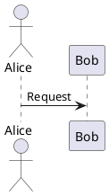
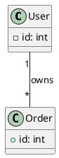

# PI222 synthetic Windows fixture

```plantuml
@startuml
actor Alice
participant Bob
Alice -> Bob: Request
@enduml
```

```plantuml
@startuml
class User {
 -id: int
}
class Order {
 +id: int
}
User "1" -- "*" Order : owns
@enduml
```

```plantuml
@startuml
!theme PI222Missing
@enduml
```

```plantuml
@startuml
class {
@enduml
```

```plantuml
@startuml
actor Alice
participant Bob
Alice -> Bob: Request
@enduml
```

[ordinary link](https://example.invalid/)
