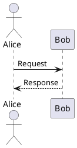
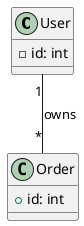

# PI222 packaged app and HTML

```plantuml
@startuml
actor Alice
participant Bob
Alice -> Bob: Request
Bob --> Alice: Response
@enduml
```

```plantuml
@startuml
class User {
 -id: int
}
class Order {
 +id: int
}
User "1" -- "*" Order: owns
@enduml
```

```plantuml
@startuml
!theme missing
@enduml
```

[Ordinary link](https://example.com/)
