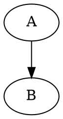

# Finder DBML multiple

```dbml
Table first { id int [pk] }
```


```dot
digraph { A -> B }
```

```dbml
Table second { id int [pk] }
```

```dbml
Table third { id int [pk] }
```

```dbml
Table fifth { id int [pk] }
```
