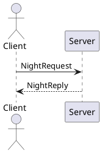
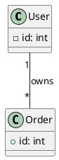

# PI222 app a831f905

```plantuml
@startuml
actor Client
participant Server
Client -> Server: NightRequest
Server --> Client: NightReply
@enduml
```

```plantuml
@startuml
class User {
 -id: int
}
class Order {
 +id: int
}
User "1" -- "*" Order: owns
@enduml
```

```plantuml
@startuml
!theme missing
@enduml
```

[Ordinary link](https://example.com/)
