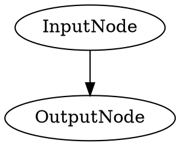

# PI222 legacy a831f905


```mermaid
flowchart LR
 StartNode --> FinishNode
```


```dot
digraph { InputNode -> OutputNode }
```

```dbml
Table rows {
 id int [pk]
}
Table items {
 id int [pk]
 row_id int [ref: > rows.id]
}
```
