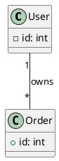
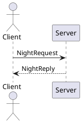
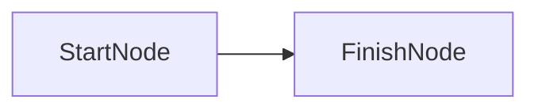
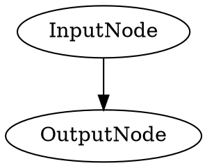

# PI222 open a831f905

```plantuml
@startuml
class User {
 -id: int
}
class Order {
 +id: int
}
User "1" -- "*" Order: owns
@enduml
```

```plantuml
@startuml
actor Client
participant Server
Client -> Server: NightRequest
Server --> Client: NightReply
@enduml
```

```mermaid
flowchart LR
 StartNode --> FinishNode
```

```dot
digraph { InputNode -> OutputNode }
```
