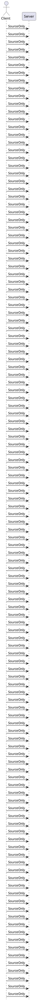

# PI222 oversized a831f905

```plantuml
@startuml
actor Client
participant Server
Client -> Server: SourceOnly
Client -> Server: SourceOnly
Client -> Server: SourceOnly
Client -> Server: SourceOnly
Client -> Server: SourceOnly
Client -> Server: SourceOnly
Client -> Server: SourceOnly
Client -> Server: SourceOnly
Client -> Server: SourceOnly
Client -> Server: SourceOnly
Client -> Server: SourceOnly
Client -> Server: SourceOnly
Client -> Server: SourceOnly
Client -> Server: SourceOnly
Client -> Server: SourceOnly
Client -> Server: SourceOnly
Client -> Server: SourceOnly
Client -> Server: SourceOnly
Client -> Server: SourceOnly
Client -> Server: SourceOnly
Client -> Server: SourceOnly
Client -> Server: SourceOnly
Client -> Server: SourceOnly
Client -> Server: SourceOnly
Client -> Server: SourceOnly
Client -> Server: SourceOnly
Client -> Server: SourceOnly
Client -> Server: SourceOnly
Client -> Server: SourceOnly
Client -> Server: SourceOnly
Client -> Server: SourceOnly
Client -> Server: SourceOnly
Client -> Server: SourceOnly
Client -> Server: SourceOnly
Client -> Server: SourceOnly
Client -> Server: SourceOnly
Client -> Server: SourceOnly
Client -> Server: SourceOnly
Client -> Server: SourceOnly
Client -> Server: SourceOnly
Client -> Server: SourceOnly
Client -> Server: SourceOnly
Client -> Server: SourceOnly
Client -> Server: SourceOnly
Client -> Server: SourceOnly
Client -> Server: SourceOnly
Client -> Server: SourceOnly
Client -> Server: SourceOnly
Client -> Server: SourceOnly
Client -> Server: SourceOnly
Client -> Server: SourceOnly
Client -> Server: SourceOnly
Client -> Server: SourceOnly
Client -> Server: SourceOnly
Client -> Server: SourceOnly
Client -> Server: SourceOnly
Client -> Server: SourceOnly
Client -> Server: SourceOnly
Client -> Server: SourceOnly
Client -> Server: SourceOnly
Client -> Server: SourceOnly
Client -> Server: SourceOnly
Client -> Server: SourceOnly
Client -> Server: SourceOnly
Client -> Server: SourceOnly
Client -> Server: SourceOnly
Client -> Server: SourceOnly
Client -> Server: SourceOnly
Client -> Server: SourceOnly
Client -> Server: SourceOnly
Client -> Server: SourceOnly
Client -> Server: SourceOnly
Client -> Server: SourceOnly
Client -> Server: SourceOnly
Client -> Server: SourceOnly
Client -> Server: SourceOnly
Client -> Server: SourceOnly
Client -> Server: SourceOnly
Client -> Server: SourceOnly
Client -> Server: SourceOnly
Client -> Server: SourceOnly
Client -> Server: SourceOnly
Client -> Server: SourceOnly
Client -> Server: SourceOnly
Client -> Server: SourceOnly
Client -> Server: SourceOnly
Client -> Server: SourceOnly
Client -> Server: SourceOnly
Client -> Server: SourceOnly
Client -> Server: SourceOnly
Client -> Server: SourceOnly
Client -> Server: SourceOnly
Client -> Server: SourceOnly
Client -> Server: SourceOnly
Client -> Server: SourceOnly
Client -> Server: SourceOnly
Client -> Server: SourceOnly
Client -> Server: SourceOnly
Client -> Server: SourceOnly
Client -> Server: SourceOnly
Client -> Server: SourceOnly
Client -> Server: SourceOnly
Client -> Server: SourceOnly
Client -> Server: SourceOnly
Client -> Server: SourceOnly
Client -> Server: SourceOnly
Client -> Server: SourceOnly
Client -> Server: SourceOnly
Client -> Server: SourceOnly
Client -> Server: SourceOnly
Client -> Server: SourceOnly
Client -> Server: SourceOnly
Client -> Server: SourceOnly
Client -> Server: SourceOnly
Client -> Server: SourceOnly
Client -> Server: SourceOnly
Client -> Server: SourceOnly
Client -> Server: SourceOnly
Client -> Server: SourceOnly
Client -> Server: SourceOnly
Client -> Server: SourceOnly
Client -> Server: SourceOnly
Client -> Server: SourceOnly
Client -> Server: SourceOnly
Client -> Server: SourceOnly
Client -> Server: SourceOnly
Client -> Server: SourceOnly
Client -> Server: SourceOnly
Client -> Server: SourceOnly
Client -> Server: SourceOnly
Client -> Server: SourceOnly
Client -> Server: SourceOnly
Client -> Server: SourceOnly
Client -> Server: SourceOnly
Client -> Server: SourceOnly
Client -> Server: SourceOnly
Client -> Server: SourceOnly
Client -> Server: SourceOnly
Client -> Server: SourceOnly
Client -> Server: SourceOnly
Client -> Server: SourceOnly
Client -> Server: SourceOnly
Client -> Server: SourceOnly
Client -> Server: SourceOnly
Client -> Server: SourceOnly
Client -> Server: SourceOnly
Client -> Server: SourceOnly
Client -> Server: SourceOnly
Client -> Server: SourceOnly
Client -> Server: SourceOnly
Client -> Server: SourceOnly
Client -> Server: SourceOnly
Client -> Server: SourceOnly
Client -> Server: SourceOnly
Client -> Server: SourceOnly
Client -> Server: SourceOnly
Client -> Server: SourceOnly
Client -> Server: SourceOnly
Client -> Server: SourceOnly
Client -> Server: SourceOnly
Client -> Server: SourceOnly
Client -> Server: SourceOnly
Client -> Server: SourceOnly
Client -> Server: SourceOnly
Client -> Server: SourceOnly
Client -> Server: SourceOnly
Client -> Server: SourceOnly
Client -> Server: SourceOnly
Client -> Server: SourceOnly
Client -> Server: SourceOnly
Client -> Server: SourceOnly
Client -> Server: SourceOnly
Client -> Server: SourceOnly
Client -> Server: SourceOnly
Client -> Server: SourceOnly
Client -> Server: SourceOnly
Client -> Server: SourceOnly
Client -> Server: SourceOnly
Client -> Server: SourceOnly
Client -> Server: SourceOnly
Client -> Server: SourceOnly
Client -> Server: SourceOnly
Client -> Server: SourceOnly
Client -> Server: SourceOnly
Client -> Server: SourceOnly
Client -> Server: SourceOnly
Client -> Server: SourceOnly
Client -> Server: SourceOnly
Client -> Server: SourceOnly
Client -> Server: SourceOnly
Client -> Server: SourceOnly
Client -> Server: SourceOnly
Client -> Server: SourceOnly
Client -> Server: SourceOnly
Client -> Server: SourceOnly
Client -> Server: SourceOnly
Client -> Server: SourceOnly
Client -> Server: SourceOnly
Client -> Server: SourceOnly
Client -> Server: SourceOnly
Client -> Server: SourceOnly
Client -> Server: SourceOnly
Client -> Server: SourceOnly
Client -> Server: SourceOnly
Client -> Server: SourceOnly
Client -> Server: SourceOnly
Client -> Server: SourceOnly
Client -> Server: SourceOnly
Client -> Server: SourceOnly
Client -> Server: SourceOnly
Client -> Server: SourceOnly
Client -> Server: SourceOnly
Client -> Server: SourceOnly
Client -> Server: SourceOnly
Client -> Server: SourceOnly
Client -> Server: SourceOnly
Client -> Server: SourceOnly
Client -> Server: SourceOnly
Client -> Server: SourceOnly
Client -> Server: SourceOnly
Client -> Server: SourceOnly
Client -> Server: SourceOnly
Client -> Server: SourceOnly
Client -> Server: SourceOnly
Client -> Server: SourceOnly
Client -> Server: SourceOnly
Client -> Server: SourceOnly
Client -> Server: SourceOnly
Client -> Server: SourceOnly
Client -> Server: SourceOnly
Client -> Server: SourceOnly
Client -> Server: SourceOnly
Client -> Server: SourceOnly
Client -> Server: SourceOnly
Client -> Server: SourceOnly
Client -> Server: SourceOnly
Client -> Server: SourceOnly
Client -> Server: SourceOnly
Client -> Server: SourceOnly
Client -> Server: SourceOnly
Client -> Server: SourceOnly
Client -> Server: SourceOnly
Client -> Server: SourceOnly
Client -> Server: SourceOnly
Client -> Server: SourceOnly
Client -> Server: SourceOnly
Client -> Server: SourceOnly
Client -> Server: SourceOnly
Client -> Server: SourceOnly
Client -> Server: SourceOnly
Client -> Server: SourceOnly
Client -> Server: SourceOnly
Client -> Server: SourceOnly
Client -> Server: SourceOnly
Client -> Server: SourceOnly
Client -> Server: SourceOnly
Client -> Server: SourceOnly
Client -> Server: SourceOnly
Client -> Server: SourceOnly
Client -> Server: SourceOnly
Client -> Server: SourceOnly
Client -> Server: SourceOnly
Client -> Server: SourceOnly
Client -> Server: SourceOnly
Client -> Server: SourceOnly
Client -> Server: SourceOnly
Client -> Server: SourceOnly
Client -> Server: SourceOnly
Client -> Server: SourceOnly
Client -> Server: SourceOnly
Client -> Server: SourceOnly
Client -> Server: SourceOnly
Client -> Server: SourceOnly
Client -> Server: SourceOnly
Client -> Server: SourceOnly
Client -> Server: SourceOnly
Client -> Server: SourceOnly
Client -> Server: SourceOnly
Client -> Server: SourceOnly
Client -> Server: SourceOnly
Client -> Server: SourceOnly
Client -> Server: SourceOnly
Client -> Server: SourceOnly
Client -> Server: SourceOnly
Client -> Server: SourceOnly
Client -> Server: SourceOnly
Client -> Server: SourceOnly
Client -> Server: SourceOnly
Client -> Server: SourceOnly
Client -> Server: SourceOnly
Client -> Server: SourceOnly
Client -> Server: SourceOnly
Client -> Server: SourceOnly
Client -> Server: SourceOnly
Client -> Server: SourceOnly
Client -> Server: SourceOnly
Client -> Server: SourceOnly
Client -> Server: SourceOnly
Client -> Server: SourceOnly
Client -> Server: SourceOnly
Client -> Server: SourceOnly
Client -> Server: SourceOnly
Client -> Server: SourceOnly
Client -> Server: SourceOnly
Client -> Server: SourceOnly
Client -> Server: SourceOnly
Client -> Server: SourceOnly
Client -> Server: SourceOnly
Client -> Server: SourceOnly
Client -> Server: SourceOnly
Client -> Server: SourceOnly
Client -> Server: SourceOnly
Client -> Server: SourceOnly
Client -> Server: SourceOnly
Client -> Server: SourceOnly
Client -> Server: SourceOnly
Client -> Server: SourceOnly
Client -> Server: SourceOnly
Client -> Server: SourceOnly
Client -> Server: SourceOnly
Client -> Server: SourceOnly
Client -> Server: SourceOnly
Client -> Server: SourceOnly
Client -> Server: SourceOnly
Client -> Server: SourceOnly
Client -> Server: SourceOnly
Client -> Server: SourceOnly
Client -> Server: SourceOnly
Client -> Server: SourceOnly
Client -> Server: SourceOnly
Client -> Server: SourceOnly
Client -> Server: SourceOnly
Client -> Server: SourceOnly
Client -> Server: SourceOnly
Client -> Server: SourceOnly
Client -> Server: SourceOnly
Client -> Server: SourceOnly
Client -> Server: SourceOnly
Client -> Server: SourceOnly
Client -> Server: SourceOnly
Client -> Server: SourceOnly
Client -> Server: SourceOnly
Client -> Server: SourceOnly
Client -> Server: SourceOnly
Client -> Server: SourceOnly
Client -> Server: SourceOnly
Client -> Server: SourceOnly
Client -> Server: SourceOnly
Client -> Server: SourceOnly
Client -> Server: SourceOnly
Client -> Server: SourceOnly
Client -> Server: SourceOnly
Client -> Server: SourceOnly
Client -> Server: SourceOnly
Client -> Server: SourceOnly
Client -> Server: SourceOnly
Client -> Server: SourceOnly
Client -> Server: SourceOnly
Client -> Server: SourceOnly
Client -> Server: SourceOnly
Client -> Server: SourceOnly
Client -> Server: SourceOnly
Client -> Server: SourceOnly
Client -> Server: SourceOnly
Client -> Server: SourceOnly
Client -> Server: SourceOnly
Client -> Server: SourceOnly
Client -> Server: SourceOnly
Client -> Server: SourceOnly
Client -> Server: SourceOnly
Client -> Server: SourceOnly
Client -> Server: SourceOnly
Client -> Server: SourceOnly
Client -> Server: SourceOnly
Client -> Server: SourceOnly
Client -> Server: SourceOnly
Client -> Server: SourceOnly
Client -> Server: SourceOnly
Client -> Server: SourceOnly
Client -> Server: SourceOnly
Client -> Server: SourceOnly
Client -> Server: SourceOnly
Client -> Server: SourceOnly
Client -> Server: SourceOnly
Client -> Server: SourceOnly
Client -> Server: SourceOnly
Client -> Server: SourceOnly
Client -> Server: SourceOnly
Client -> Server: SourceOnly
Client -> Server: SourceOnly
Client -> Server: SourceOnly
Client -> Server: SourceOnly
Client -> Server: SourceOnly
Client -> Server: SourceOnly
Client -> Server: SourceOnly
Client -> Server: SourceOnly
Client -> Server: SourceOnly
Client -> Server: SourceOnly
Client -> Server: SourceOnly
Client -> Server: SourceOnly
@enduml
```
