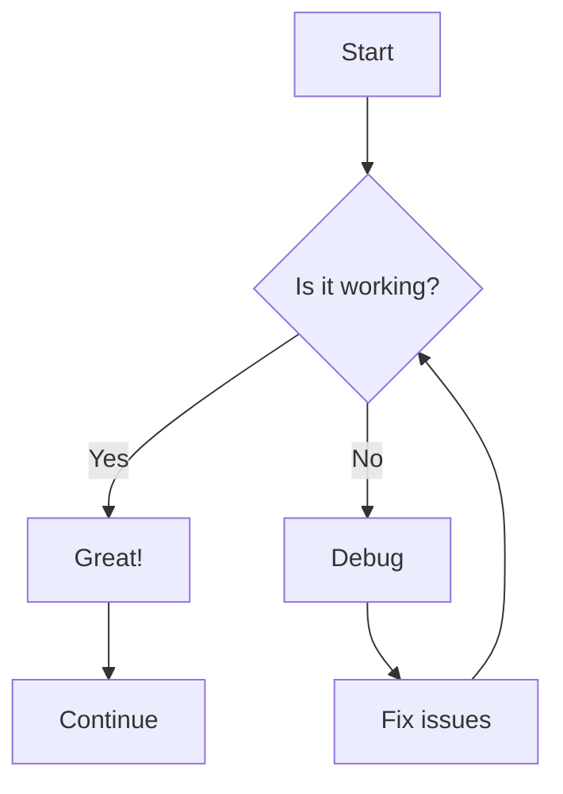
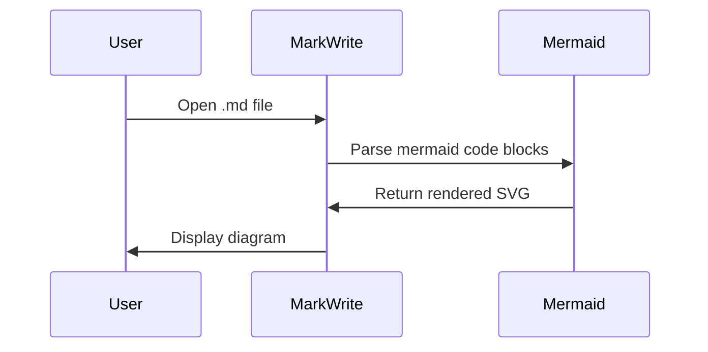
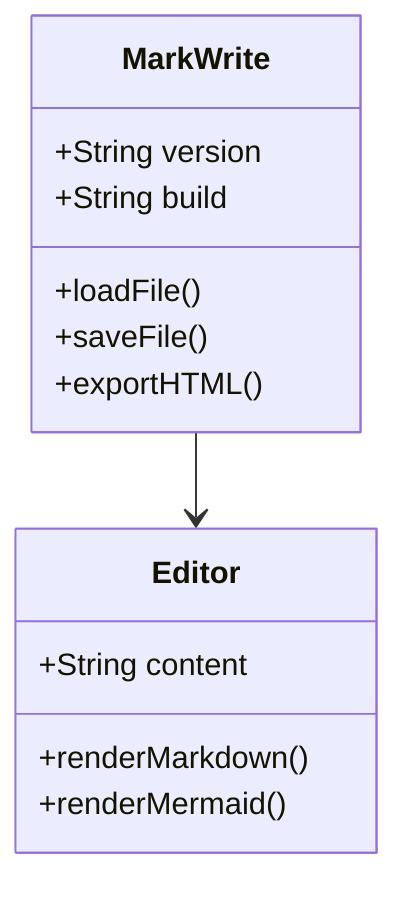
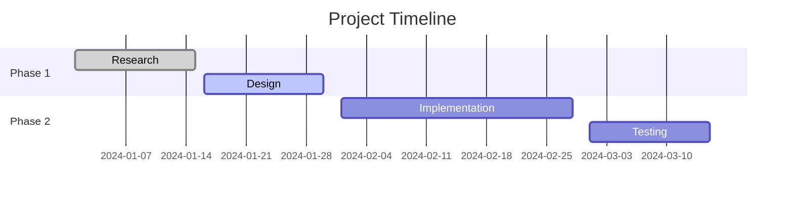

# Mermaid Diagram Test

This is a test file to verify that Mermaid diagrams are working correctly in MarkWrite.

## Flowchart Example

## Sequence Diagram Example

## Class Diagram Example

## Gantt Chart Example

This file should now display all the diagrams correctly when opened in MarkWrite!
